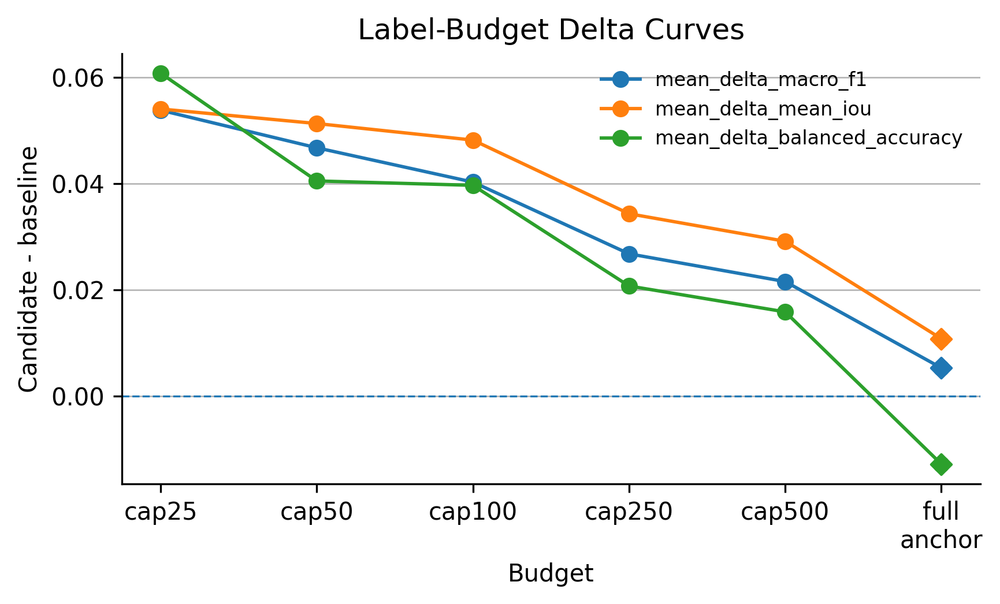
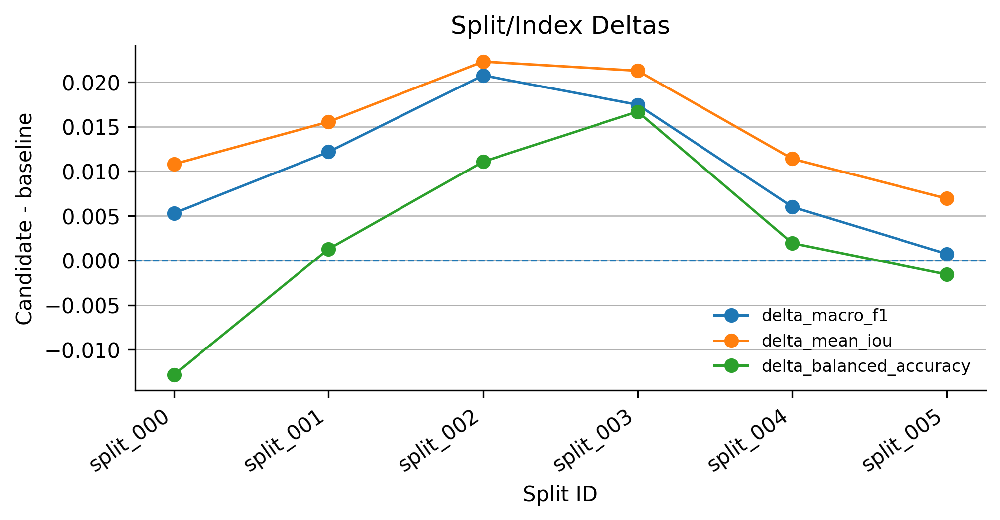
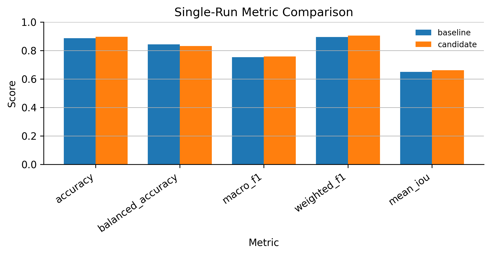

# F3 Strat-HMM Milestone-1 Results Summary

- baseline model: amp_mae_m075_mse_g0_patchnorm_clip8_agc65_vis01_v1
- candidate model: strat_hmm_pretext_m1_k6_topblock1_distill
- HMM labels are a structured pretext signal, not final lithology outputs.
- Single-run result is strong positive: delta_macro_f1=0.005309, delta_mean_iou=0.010809.
- Label-budget robustness is strongest in low-label regimes; monitor the full-budget balanced accuracy caveat.
- Split/index robustness shows positive macro F1 and mean IoU deltas on all tested splits.

## Label Budget

| budget_id | per_class_cap | n_pairs | mean_delta_macro_f1 | mean_delta_mean_iou | mean_delta_balanced_accuracy |
| --- | ---: | ---: | ---: | ---: | ---: |
| cap25 | 25 | 5 | 0.053841 | 0.054076 | 0.060808 |
| cap50 | 50 | 5 | 0.046769 | 0.051336 | 0.040527 |
| cap100 | 100 | 5 | 0.040306 | 0.048219 | 0.039698 |
| cap250 | 250 | 5 | 0.026798 | 0.034348 | 0.020739 |
| cap500 | 500 | 5 | 0.021574 | 0.029162 | 0.015862 |
| full |  | 1 | 0.005309 | 0.010809 | -0.012804 |

## Split Index

| split_id | delta_macro_f1 | delta_mean_iou | delta_balanced_accuracy |
| --- | ---: | ---: | ---: |
| split_000 | 0.005309 | 0.010809 | -0.012804 |
| split_001 | 0.012173 | 0.015540 | 0.001287 |
| split_002 | 0.020749 | 0.022292 | 0.011071 |
| split_003 | 0.017458 | 0.021268 | 0.016686 |
| split_004 | 0.006009 | 0.011400 | 0.001941 |
| split_005 | 0.000740 | 0.006939 | -0.001571 |

## Single-Run Metrics

## Decision

- guidance: go
- summary: Strat-HMM M1 is positive on single-run macro F1/mean IoU, label-budget robustness, and split/index macro F1/mean IoU.

## Warnings

- full duplicate label-budget rows collapsed by paired identity
- full budget balanced_accuracy delta is negative; monitor this caveat
