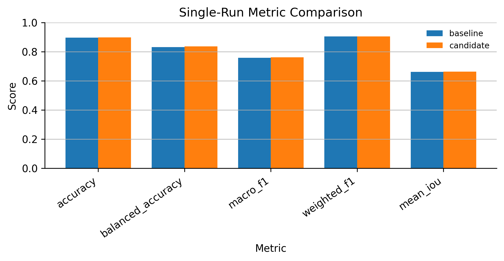
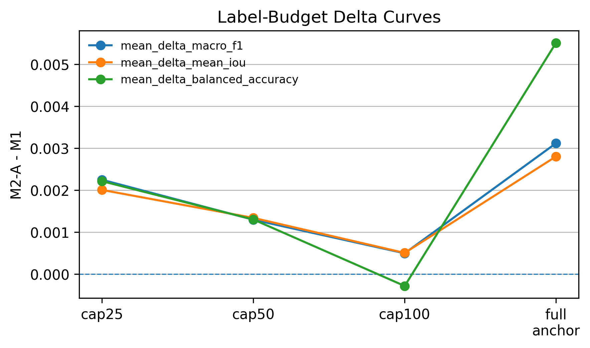
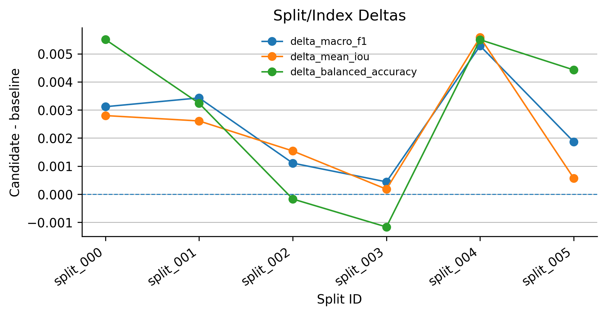
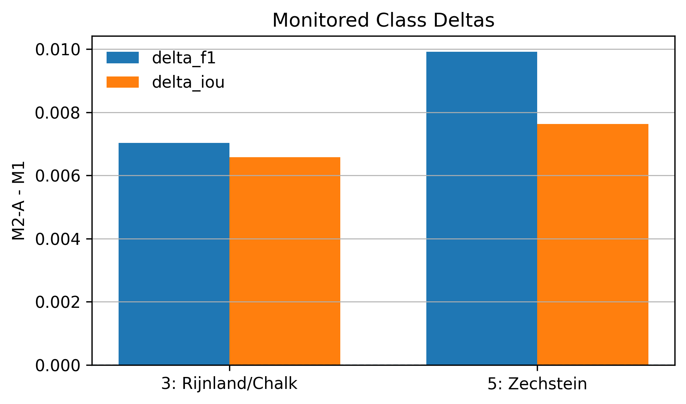

# F3 Strat-HMM M2-A Results Summary

- baseline model: strat_hmm_pretext_m1_k6_topblock1_distill
- candidate model: strat_hmm_pretext_m2a_boundary_a050_t2_k6_topblock1_distill
- decision: **GO**
- reason codes: all_go_conditions_met

## Decision Checks

- `go_checks.low_budget_positive`: `true`
- `go_checks.split_joint_win_rate_strict_majority`: `true`
- `go_checks.full_split_balanced_accuracy_nonnegative`: `true`
- `go_checks.monitored_class_pareto_improvement`: `true`
- `stop_checks.all_low_budgets_nonpositive`: `false`
- `stop_checks.split_joint_loss_rate_strict_majority`: `false`
- `stop_checks.all_monitored_classes_worse_without_primary_improvement`: `false`

## Single Split

## Label Budget

## Split/Index

## Monitored Classes

| class | F1 M1 | F1 M2-A | delta F1 | IoU M1 | IoU M2-A | delta IoU | support |
| --- | ---: | ---: | ---: | ---: | ---: | ---: | ---: |
| 3: Rijnland/Chalk | 0.534584 | 0.541618 | 0.007034 | 0.364800 | 0.371383 | 0.006583 | 354 |
| 5: Zechstein | 0.382716 | 0.392638 | 0.009922 | 0.236641 | 0.244275 | 0.007634 | 46 |
